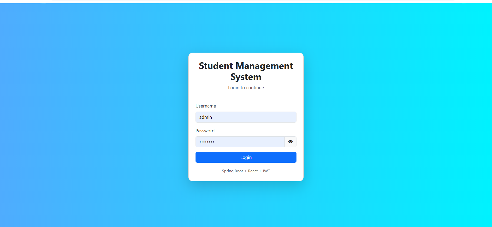
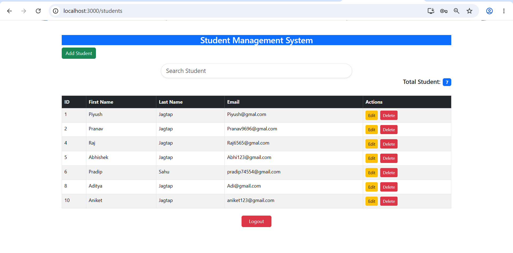
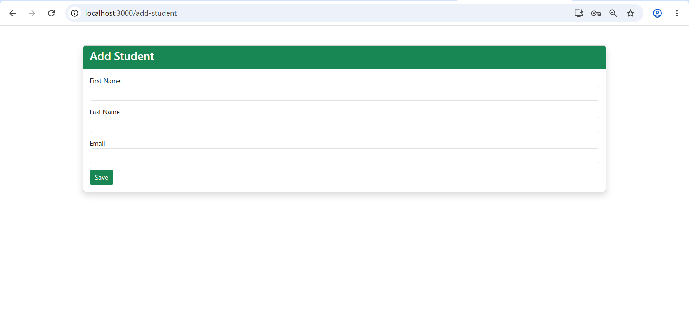
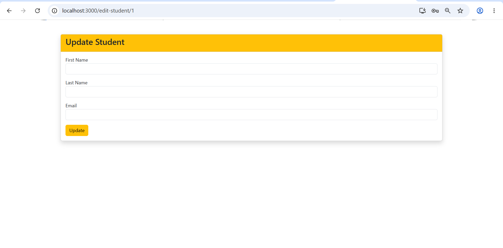

Student Management System

A Full Stack Student Management System developed using Java, Spring Boot, React, MySQL, and JWT Authentication.

Features

- Student Registration
- View Student Records
- Update Student Details
- Delete Student Records
- Search Students
- JWT Authentication & Authorization
- RESTful APIs
- Responsive User Interface

Technologies Used

Backend

- Java
- Spring Boot
- Spring Data JPA
- Spring Security
- JWT Authentication
- MySQL

Frontend

- React JS
- Bootstrap
- Axios

Project Structure

Student-Management-System

│

├── backend

│

└── frontend

Screenshots

Login Page

Student List

Add Student

Update Student

Backend Setup

1. Open backend project in IDE.
2. Configure MySQL database.
3. Update "application.properties".
4. Run Spring Boot Application.

Frontend Setup

cd frontend

npm install

npm start

Frontend runs on:

http://localhost:3000

Backend runs on:

http://localhost:8080

API Features

- User Login
- JWT Token Generation
- Student CRUD Operations

Author

Piyush Jagtap
